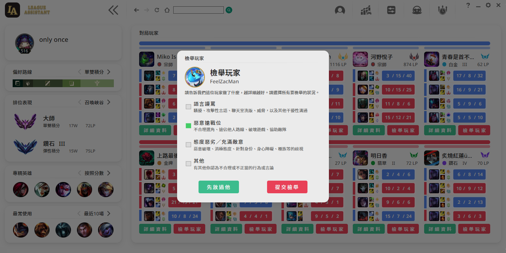

# LeagueAssistant

 

> 🫰 [提供建議](https://discord.com/channels/1062726976370126968/1064135225787035648)
> 🚨 [錯誤回報](https://discord.com/channels/1062726976370126968/1064135225787035648)
> 🚩 [助手下载](https://www.leefuuchang.in/projects/LeagueAssistant/Download/Setup)

## 功能简介

💡	玩家查詢：「 對戰紀錄、戰棋紀錄、專精英雄、對局詳情、圖表化玩家數據 」

💡 	遊戲數據：「 OPGG英雄數據、OPGG戰棋數據、玩家挑戰數據 」

💡 	特殊功能：「 自動接受、秒選英雄、秒禁英雄、自動更換符文頁、自動更換召喚師技能 」

💡 	特殊功能：「 召喚師技能冷卻浮窗、遊戲中紀錄召喚師技能冷卻、一鍵發送召喚師技能冷卻 」

## 玩家查詢－對戰紀錄
 
 

## 玩家查詢－戰棋紀錄
 

## 玩家查詢－圖表化玩家數據
 

## 遊戲數據－OPGG英雄數據
 
 

## 遊戲數據－OPGG戰棋數據
 
 

## 遊戲數據－玩家挑戰數據
 

## 遊戲數據－實時稽查對局玩家
 
 

## 特殊功能－客製化設定頁面
  
  
  
  

## Star History
<a href="https://star-history.com/#LeeFuuChang/LeagueAssistant&Date">
  <picture>
    <source media="(prefers-color-scheme: dark)" srcset="https://api.star-history.com/svg?repos=LeeFuuChang/LeagueAssistant&type=Date&theme=dark" />
    <source media="(prefers-color-scheme: light)" srcset="https://api.star-history.com/svg?repos=LeeFuuChang/LeagueAssistant&type=Date" />
    
  </picture>
</a>
